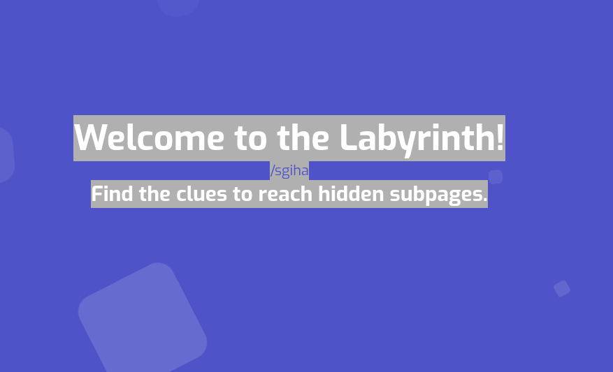
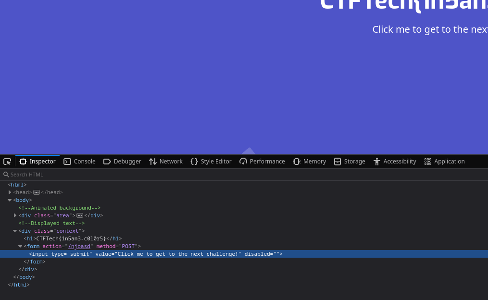
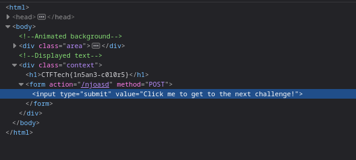
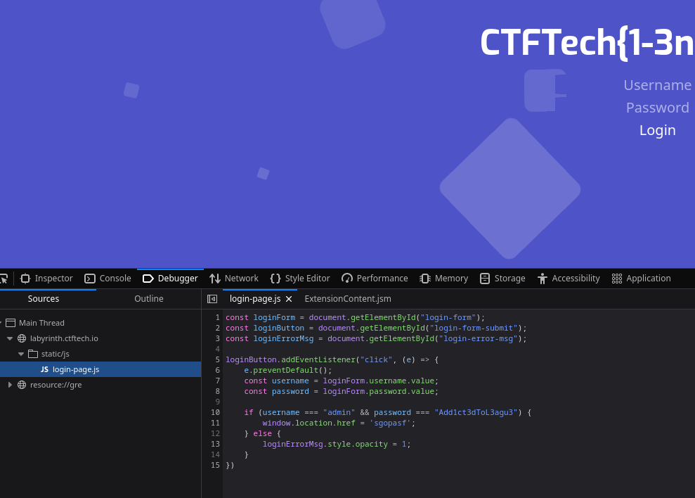
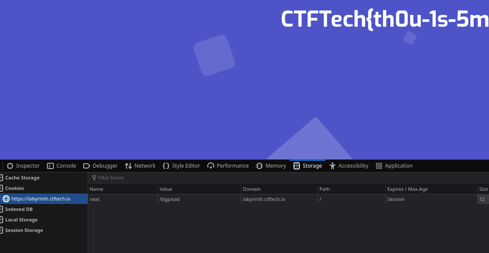
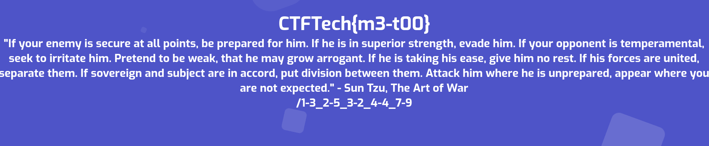
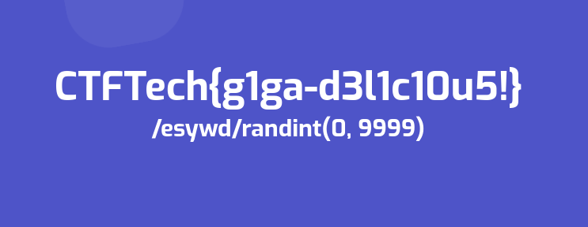

# Task 1

Press CTRL + A to highlight all the text on the page.

# Task 2

1. Open your browser's Inspector and find the button.
2. Remove **disabled=""** from the button.
3. Click the button on the page.

# Task 3

1. Open your browser's JavaScript Debugger and view the **login-page.js** file.
2. Use the credentials found in the file to login.

# Task 4

1. Open your browser's Developer Tools and navigate to the **Storage** tab.
2. Open up the **Cookies** section and check the cookie named **next**.

# Task 5

Each number pair given is a coordinate for a letter. The first number in a pair tells you which sentence to look at. The second number tells you which word's (in the sentence) first letter it is. The outcome is **/esywd**.

Note: If you go to **https://labyrinth.ctftech.io/esywd** and the page seems to be stuck at the loading phase you need to add a **/** to the end (**https://labyrinth.ctftech.io/esywd/**).

# Task 6

1. Generate or download a wordlist containing numbers from 0 to 9999 (including).
2. Use a tool (e.g. gobuster) to automatically go through all the subpages on the path **https://labyrinth.ctftech.io/esywd/...** and find out which one exists and visit it. Gobuster's syntax to find the answer would be **gobuster dir -u https://labyrinth.ctftech.io/esywd/ -w numbers_wordlist.txt --wildcard**.

